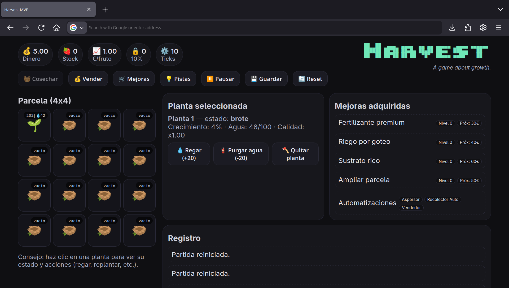

# 🌱 Harvest Game

```
██  ██  ▄▄▄  ▄▄▄▄  ▄▄ ▄▄ ▄▄▄▄▄  ▄▄▄▄ ▄▄▄▄▄▄ 
██████ ██▀██ ██▄█▄ ██▄██ ██▄▄  ███▄▄   ██   
██  ██ ██▀██ ██ ██  ▀█▀  ██▄▄▄ ▄▄██▀   ██   
```

*A game about growth.*

## 🎮 Game Overview

Harvest is an engaging farming simulation game where you manage a small plot of land, growing and harvesting fruits while dealing with realistic challenges like water management, plant health, and economic decisions.



## 🎯 Gameplay Features

### 🌾 Core Mechanics
- **Plant Management**: Start with a single plant and expand your farm
- **Water System**: Maintain optimal water levels (20-90) for healthy growth
- **Growth Stages**: Watch plants progress from seedling → growing → ripe
- **Manual Harvesting**: Initially harvest each plant individually
- **Economic Strategy**: Balance costs and profits to grow your operation

### 💧 Water Management
- Plants consume water over time (0.8 units per tick)
- **Optimal Range**: 20-90 water units for healthy growth
- **Drought Risk**: Below 10 water units causes stress
- **Flood Risk**: Above 90 water units causes stress
- **Cost**: Watering costs money (€0.01 per water unit)

### 🐛 Plant Health System
- **Stress Tracking**: Prolonged drought or flooding increases stress
- **Plague System**: Stressed plants are more susceptible to plagues
- **Death Risk**: Severely stressed plants may die
- **Treatment**: Plagues can be treated for €2

### 💰 Economic System
- **Stock Reserve**: 10% of your fruit stock is always reserved
- **Dynamic Pricing**: Base price affected by quality upgrades
- **Upgrade Costs**: Prices increase by 120% with each purchase level

## 🛒 Upgrades & Progression

### 🔧 Basic Upgrades
1. **Recolector (€5)** - *First upgrade!* Unlocks global harvest button
2. **Fertilizante Premium (€30+)** - Increases fruit price by 25% per level
3. **Riego por Goteo (€40+)** - Increases growth speed by 25% per level
4. **Sustrato Rico (€60+)** - Increases fruit yield by 40% per level
5. **Ampliar Parcela (€50+)** - Adds new plant slots to your farm

### 🤖 Automation Systems
- **Aspersor Automático (€80)** - Auto-waters plants when water < 60
- **Recolector Automático (€120)** - Auto-harvests ripe plants
- **Vendedor Automático (€150)** - Auto-sells excess stock

## 🎮 How to Play

### Getting Started
1. **Initial Setup**: You start with €5, one plant, and no upgrades
2. **Water Management**: Click on your plant and use "💧 Regar" to add water
3. **Growth Monitoring**: Watch the growth percentage and water levels
4. **Manual Harvest**: When plants reach 100% growth, manually harvest each one
5. **First Purchase**: Save up €5 to buy the "Recolector" upgrade for global harvesting

### Strategic Tips
- **Water Efficiency**: Keep water between 20-90 for optimal growth
- **Plague Prevention**: Avoid prolonged water stress to prevent plagues  
- **Economic Balance**: Don't spend all your money - keep reserves for water costs
- **Upgrade Priority**: Buy the Recolector first, then focus on growth or yield upgrades
- **Automation Investment**: Automate repetitive tasks as you scale up

### Controls
- **Click Plants**: Select individual plants for detailed actions
- **🧺 Cosechar**: Global harvest button (requires Recolector upgrade)
- **💰 Vender**: Sell all available stock (respects 10% reserve)
- **🛒 Mejoras**: Open upgrade shop
- **⏸️ Pausar / P Key**: Pause/resume the game
- **💾 Guardar**: Manual save (auto-saves every 30 seconds)

## 🔧 Technical Details

### Game Loop
- **Tick Rate**: 500ms per game tick
- **Auto-Save**: Every 30 seconds
- **Real-Time**: Continuous simulation when not paused

### Plant States
- **Empty**: No plant in slot
- **Seedling**: 0-25% growth (🌱)
- **Growing**: 25-100% growth (🪴) 
- **Ripe**: Ready for harvest (🍓)
- **Dead**: Requires removal (💀)

### Status Indicators
- **💧**: Water level (0-100)
- **%**: Growth progress
- **🐛**: Plague infection
- **💀**: Plant death

## 🚀 Installation & Setup

### Local Development
```bash
# Clone the repository
git clone <repository-url>
cd harvest-game

# Serve locally (Python 3)
python3 -m http.server 8000

# Or use any static file server
# Then open http://localhost:8000
```

### File Structure
```
harvest-game/
├── index.html      # Main game interface
├── script.js       # Game logic and mechanics
├── styles.css      # UI styling and layout
├── game.png        # Interface screenshot
└── README.md       # This documentation
```

## 🎨 Design Philosophy

**Harvest** focuses on meaningful progression and strategic decision-making:

- **Gradual Complexity**: Start simple, unlock features through gameplay
- **Resource Management**: Balance water costs, upgrade investments, and growth
- **Visual Feedback**: Clear indicators for plant health and game state
- **Accessibility**: Intuitive controls with helpful tooltips and guides

## 🔄 Game States & Persistence

- **Local Storage**: Game automatically saves progress locally
- **State Migration**: Handles save file compatibility across updates
- **Pause System**: Complete game pause with visual overlay
- **Reset Option**: Fresh start available anytime

## 🎯 Victory Conditions

While Harvest is an open-ended simulation, players typically aim to:
- Build a fully automated farm with all upgrades
- Achieve sustainable profit margins
- Master the balance between growth and automation
- Expand to maximum plot capacity

---

**Enjoy growing your virtual harvest! 🌾**

*For issues or suggestions, please check the repository's issue tracker.*